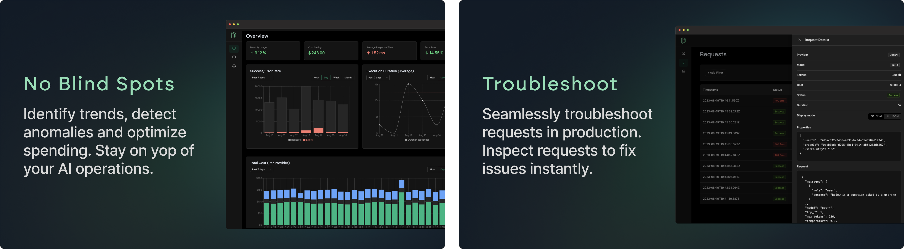
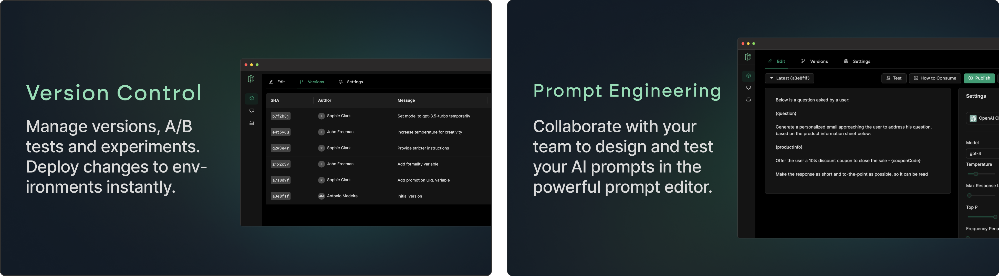
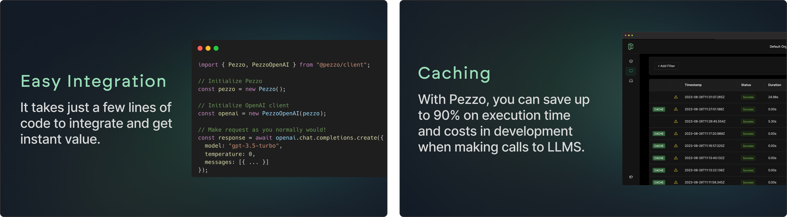

<p align="center">

  <h1 align="center">
  <a href="https://pezzo.ai/#gh-light-mode-only" target="_blank">
    
  </a>

  <a href="https://pezzo.ai/#gh-dark-mode-only" target="_blank">
    
  </a>
  </h1>
</p>

<p align="center">
  <strong>
    Pezzo is a fully cloud-native and open-source LLMOps platform. Seamlessly observe and monitor your AI operations, troubleshoot issues, save up to 90% on costs and latency, collaborate and manage your prompts in one place, and instantly deliver AI changes.
  </strong><br/><br/>
  <a href="https://pezzo.cc/discord" target="_blank">
    
  </a>&nbsp;
  <a href="https://pezzo.cc/3qzMpGb" target="_blank">
    
  </a>&nbsp;
  <a href="https://pezzo.cc/3qy415j" target="_blank">
    
  </a>&nbsp;
</p>

<p align="center">

<a href="CODE_OF_CONDUCT.md">
  
</a>
<a href="https://opensource.org/licenses/Apache-2.0">
  
</a>
<a href="https://www.npmjs.com/package/@pezzo/client" target="_blank">
  
</a>
</p>

<p align="center">
  <a href="https://pezzo.cc/demo-video-gh" target="_blank">
  
  </a>
</p>

<p align="center">

</p>

# ✨ Features

<p align="center">
    
</p>

<p align="center">
    
</p>

<p align="center">
    
</p>

# Documentation

[Click here to navigate to the Official Pezzo Documentation](https://docs.pezzo.ai/)

In the documentation, you can find information on how to use Pezzo, its architecture, including tutorials and recipes for varius use cases and LLM providers.

# Supported Clients

<table>
  <thead>
    <tr>
      <th>Feature</th>
      <th>
        <a href="https://www.npmjs.com/package/@pezzo/client">Node.js</a>
        • 
        <a href="https://docs.pezzo.ai/client/pezzo-client-node">Docs</a>
      </th>
      <th>
        <a href="https://pypi.org/">Python</a>
         • 
        <a href="https://docs.pezzo.ai/client/pezzo-client-python">Docs</a>
      </th>
      <th>
        <a href="https://github.com/pezzolabs/pezzo/issues/180">LangChain</a>
      </th>
    </tr>
  </thead>
  <tbody>
    <tr>
      <td>Prompt Management</td>
      <td align="center">✅</td>
      <td align="center">✅</td>
      <td align="center">✅</td>
    </tr>
    <tr>
      <td>Observability</td>
      <td align="center">✅</td>
      <td align="center">✅</td>
      <td align="center">✅</td>
    </tr>
    <tr>
      <td>Caching</td>
      <td align="center">✅</td>
      <td align="center">✅</td>
      <td align="center">✅</td>
    </tr>
  </tbody>
</table>

Looking for a client that's not listed here? [Open an issue](https://github.com/pezzolabs/pezzo/issues/new/choose) and let us know!

# Getting Started - Docker Compose

If you simplay want to run the full Pezzo stack locally, check out [Running With Docker Compose](http://docs.pezzo.ai/introduction/docker-compose) in the documentation.

If you want to run Pezzo in development mode, continue reading.

### Prerequisites

- Node.js 18+
- Docker
- (Recommended) [GraphQL Language Feature Support VSCode Extension](https://marketplace.visualstudio.com/items?itemName=GraphQL.vscode-graphql)

### Install dependencies


Install nvm to manage different versions of node

```
brew install nvm

## Add below lines to your ~/.zshrc or ~/.bashrc files

export NVM_DIR="$HOME/.nvm"
[ -s "$NVM_DIR/nvm.sh" ] && \. "$NVM_DIR/nvm.sh"
```


Install NPM dependencies by running:

```
nvm use

## Confirm node version
node -v
>> v18.16.0


npm install
```

### Spin up infrastructure dependencies via Docker Compose

Pezzo is entirely cloud-native and relies solely on open-source technologies such as [PostgreSQL](https://www.postgresql.org/), [ClickHouse](https://github.com/ClickHouse/ClickHouse), [Redis](https://github.com/redis/redis) and [Supertokens](https://supertokens.com/).

You can run these dependencies via Docker Compose:

```
docker-compose -f docker-compose.infra.yaml up
```

GAI API dependecy

You may set up GAI platform locally and execute it. Follow [this guide](https://github.com/smartnews/gai-api-backend) for set up.


Or you can use port forwarding to access the dev service

```

## Yes dev service is in prd env :)
$(spaas aws configure --system sn-feature --env prd)
kubectl -n sn-feature port-forward service/gai-api-backend-dev 8081:80
```

### Start Pezzo

Deploy Prisma migrations:

```
npx dotenv-cli -e apps/server/.env -- npx prisma migrate deploy --schema apps/server/prisma/schema.prisma
```

Run the server:

```
npx nx serve server
```

The server is now running. You can verify that by navigating to http://localhost:3000/api/healthz.

In development mode, you want to run `codegen` in watch mode, so whenever you make changes to the schema, types are generated automatically. After running the server, run the following in a _separate terminal Window_:

```
npm run graphql:codegen:watch
```

This will connect [codegen](https://the-guild.dev/graphql/codegen/docs/getting-started) directly to the server and keep your GraphQL schema up-to-date as you make changes.

Finally, you are ready to run the Pezzo Console:

```
npx nx serve console
```

Login via http://localhost:4200/admin/login and sign up to create a new admin user. Also use the same URL and chose sign in if having any issues accessing the UI


For debugging server app in vscode confirm `runtimeExecutable` inside [debug config](./vscode/launch.json)

That's it! The Pezzo Console is now accessible at http://localhost:4200 🚀

# Contributing

We welcome contributions from the community! Please feel free to submit pull requests or create issues for bugs or feature suggestions.

If you want to contribute but not sure how, join our [Discord](https://pezzo.cc/discord) and we'll be happy to help you out!

Please check out [CONTRIBUTING.md](CONTRIBUTING.md) before contributing.

# License

This repository's source code is available under the [Apache 2.0 License](LICENSE).
