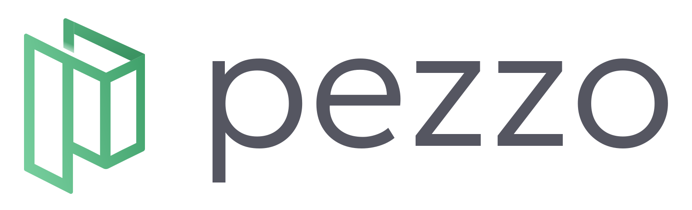
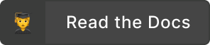
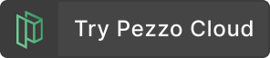
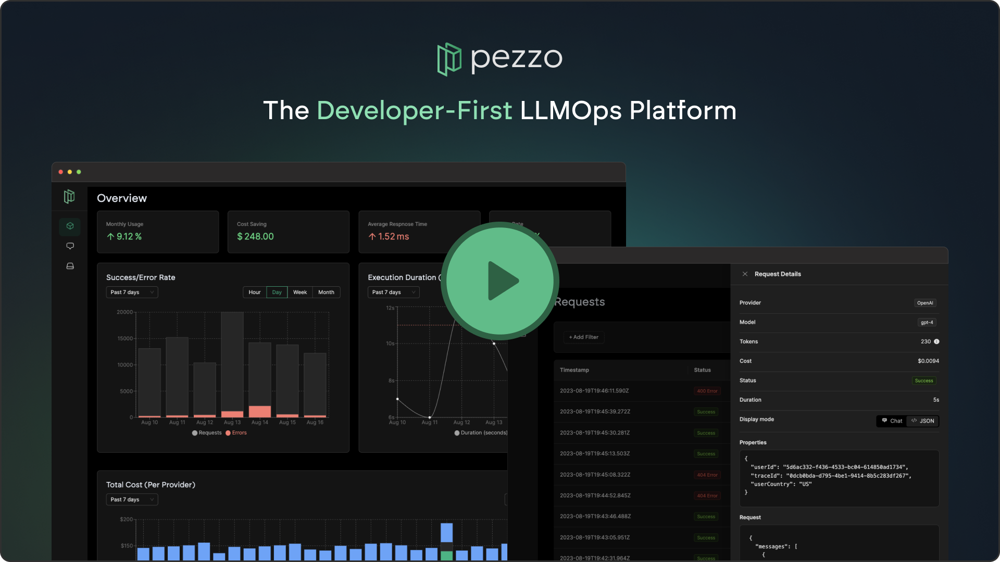

<p align="center">

  <h1 align="center">
  <a href="https://pezzo.ai/#gh-light-mode-only" target="_blank">
    
  </a>

  <a href="https://pezzo.ai/#gh-dark-mode-only" target="_blank">
    
  </a>
  </h1>
</p>

<p align="center">
  <strong>
    Pezzo is the open-source LLMOps platform built for developers and teams. In just two lines of code, you can seamlessly troubleshoot your AI operations, collaborate and manage your prompts in one place, and instantly deploy changes to any environment.
  </strong><br/><br/>
  <a href="https://pezzo.cc/discord" target="_blank">
    
  </a>&nbsp;
  <a href="https://pezzo.cc/3qzMpGb" target="_blank">
    
  </a>&nbsp;
  <a href="https://pezzo.cc/3qy415j" target="_blank">
    
  </a>&nbsp;
</p>

<p align="center">

<a href="CODE_OF_CONDUCT.md">
  
</a>
<a href="https://opensource.org/licenses/Apache-2.0">
  
</a>
<a href="https://www.npmjs.com/package/@pezzo/client" target="_blank">
  
</a>
</p>

<p align="center">
  <a href="https://pezzo.cc/demo-video-gh" target="_blank">
  
  </a>
</p>

<p align="center">

</p>

# ✨ Features

<p align="center">
    
</p>

<p align="center">
    
</p>

<p align="center">
    
</p>

# Documentation

[Click here to navigate to the Official Pezzo Documentation](https://docs.pezzo.ai/)

In the documentation, you can find information on how to use Pezzo, its architecture, including tutorials and recipes for varius use cases and LLM providers.

# Getting Started - Local Development

This section is useful for contributors who want to run Pezzo locally in development mode.

### Prerequisites

- Node.js 18+
- Docker
- (Recommended) [GraphQL Language Feature Support VSCode Extension](https://marketplace.visualstudio.com/items?itemName=GraphQL.vscode-graphql)

### Install dependencies

Install NPM dependencies by running:

```
npm install
```

### Spin up development dependencies via Docker Compose

Pezzo is entirely cloud-native and relies solely on open-source technologies such as [PostgreSQL](https://www.postgresql.org/), [OpenSearch](https://github.com/opensearch-project/OpenSearch), and [Supertokens](https://supertokens.com/).

Spin these dependencies up via Docker Compose:

```
docker-compose -f docker-compose.dev.yaml up
```

### Start Pezzo

Generate the Prisma client:

```
npx nx prisma:generate server
```

Deploy Prisma migrations:

```
npx dotenv-cli -e apps/server/.env -- npx prisma migrate deploy --schema apps/server/prisma/schema.prisma
```

Run the server:

```
npx nx serve server
```

The server is now running. In the background, [graphql-codegen](https://www.npmjs.com/package/@graphql-codegen/cli) has generated GraphQL types based on the actual schema. These can be found at [libs/graphql/src/@generated](libs/graphql/src/@generated). This provides excellent type safety across the monorepo.

In development mode, you want to run `graphql-codegen` in watch mode, so whenever you make changes to the schema, types are generated automatically. In a separate Terminal tab, run:

```
npm run graphql:codegen:watch
```

Finally, you are ready to run the Pezzo Console:

```
npx nx serve console
```

That's it! Pezzo is now accessible at http://localhost:4200 🚀

# Contributing

We welcome contributions from the community! Please feel free to submit pull requests or create issues for bugs or feature suggestions.

If you want to contribute but not sure how, join our [Discord](https://pezzo.cc/discord) and we'll be happy to help you out!

Please check out [CONTRIBUTING.md](CONTRIBUTING.md) before contributing.

# License

This repository's source code is available under the [Apache 2.0 License](LICENSE).
