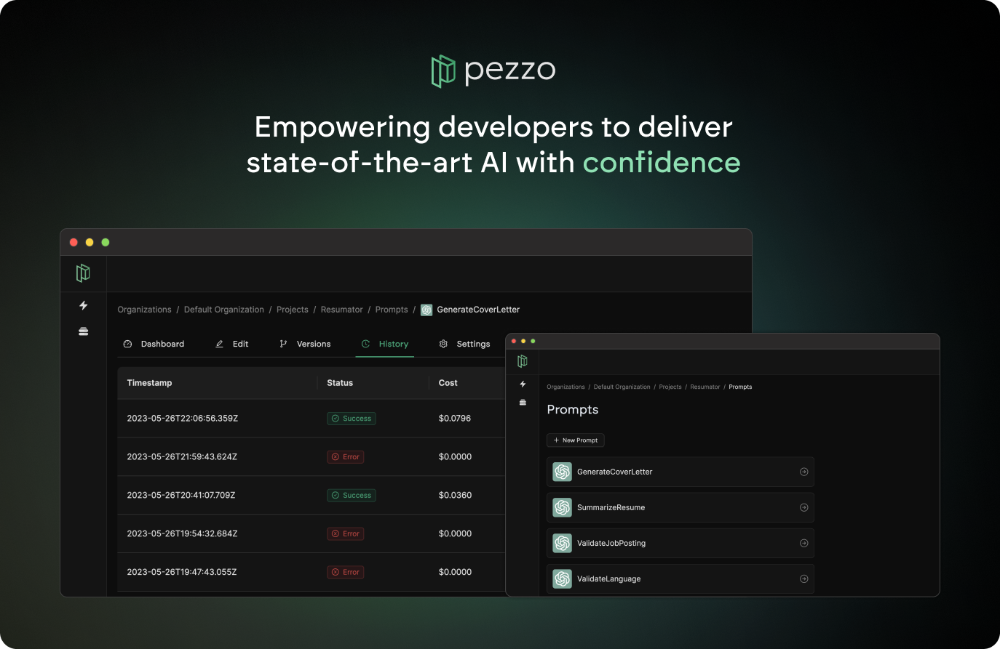

<p align="center">
  
  <br />
  <strong>
  <br />
  Pezzo is an open-source AI development toolkit designed to streamline prompt design, version management, publishing, collaboration, troubleshooting, observability and more. Our mission is to empower individuals and teams to harness the power of AI with maximum productivity and visibility.
  </strong>
  <br />
</p>
<br />
<p align="center">
  
</p>

# Features

🎛️ **Centralized Prompt Management**: Manage all AI prompts in one place for maximum visibility and efficiency.

🚀 **Streamlined Prompt Design, Publishing & Versioning:** Create, edit, test and publish prompts with ease.

🔍 **Observability**: Access detailed prompt execution history, stats and metrics (duration, prompt cost, completion cost, etc.) for better insights.

🛠️ **Troubleshooting:** Effortlessly resolve issues with your prompts. Time travel to retroactively fine-tune failed prompts and commit the fix instantly.

💰 **Cost Transparency**: Gain comprehensive cost transparency across all prompts and AI models.

💡 **Simplified Integration:** Reduce code overhead by 90% by consuming your AI prompts using the Pezzo Client, regardless of the model provider.

# Roadmap

Below you can find the roadmap with all upcoming features:

| **Feature**                | **Status**     |
| -------------------------- | -------------- |
| Demo app                   | 🚧 In Progress |
| Documentation Site         | 🚧 In Progress |
| Logger                     | 🚧 In Progress |
| Error Handling             | 🚧 In Progress |
| Official Helm Chart        | 🔜 Coming Soon |
| Test Coverage              | 🔜 Coming Soon |
| Public Sandbox Environment | 🔜 Coming Soon |
| Pezzo Client for Python    | 🔜 Coming Soon |
| Pezzo Client for Golang    | 🔜 Coming Soon |

If you are missing features, please create an issue and we'll consider adding them to the roadmap.

# Getting Started
Clone the repository:
```
git clone git@github.com:pezzolabs/pezzo.git
```

Next, make sure you configure the [.env.local](.env.local).

## 🐳 Option 1: Running Pezzo via Docker Compose

This is a straightforward way to run Pezzo and start using it.

Simply run the following command:
```
docker-compose up
```

Pezzo should now be accessible at https://localhost:4201. 🚀

## 🕹️ Option 2: Running Pezzo in Development Mode

This method is useful for contirbutors and developers.

### Prerequisites
* Node.js 18+
* Docker
* (Recommended) [GraphQL Language Feature Support VSCode Extension](https://marketplace.visualstudio.com/items?itemName=GraphQL.vscode-graphql)

### Install dependencies
Install NPM dependencies by running:
```
npm install
```

### Spin up development dependencies via Docker Compose
Pezzo relies on a Postgres database. You can spin it up using Docker Compose:
```
docker-compose -f docker-compose.dev.yaml up
```

### Start Pezzo
Generate the Prisma client:
```
npx nx prisma:generate server
```

Deploy Prisma migrations:
```
npx dotenv-cli -e apps/server/.env -- npx prisma migrate deploy --schema apps/server/prisma/schema.prisma
```

Run the server:
```
npx nx serve server
```

The server is now running. In the background, [graphql-codegen](https://www.npmjs.com/package/@graphql-codegen/cli) has generated GraphQL types based on the actual schema. These can be found at [libs/graphql/src/@generated](libs/graphql/src/@generated). This provides excellent type safety across the monorepo.

In development mode, you want to run `graphql-codegen` in watch mode, so whenever you make changes to the schema, types are generated automatically. In a separate Terminal tab, run:

```
npx nx graphql-codegen graphql --watch
```

Finally, you are ready to run the Pezzo Console:
```
npx nx serve console
```

That's it! Pezzo is now accessible at http://localhost:4201. 🚀

# Contributing

We welcome contributions from the community! Please feel free to submit pull requests or create issues for bugs or feature suggestions.

# Alpha Disclaimer

Pezzo is currently in early development stages. As we strive to provide a reliable and useful platform, you may encounter bugs, performance issues or other limitations. As a result, Pezzo cannot be held responsible for any errors, data loss, or other negative outcomes that may arise from usage during this stage.

# License

This repository's source code is available under the [BSD 3-Clause License](LICENSE).
