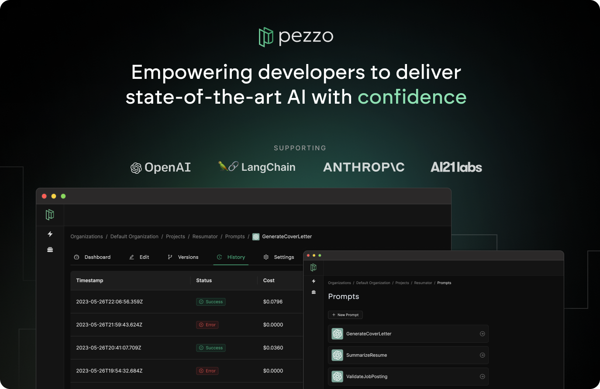

<p align="center">
  
  <br />
  <strong>
  <br />
  Pezzo is an open-source AI development toolkit designed to streamline prompt design, version management, publishing, collaboration, troubleshooting, observability and more. Our mission is to empower individuals and teams to harness the power of AI with maximum productivity and visibility.
  </strong>
  <br />
</p>
<br />
<p align="center">
  
</p>

# Features
🎛️ **Centralized Prompt Management**: Manage all AI prompts in one place for maximum visibility and efficiency.

🚀 **Streamlined Prompt Design, Publishing & Versioning:** Create, edit, test and publish prompts with ease.

🔍 **Observability**: Access detailed prompt execution history, stats and metrics (duration, prompt cost, completion cost, etc.) for better insights. 

🛠️ **Troubleshooting:** Effortlessly resolve issues with your prompts. Time travel to retroactively fine-tune failed prompts and commit the fix instantly.

💰 **Cost Transparency**: Gain comprehensive cost transparency across all prompts and AI models.

💡 **Simplified Integration:** Reduce code overhead by 90% by consuming your AI prompts using the Pezzo Client, regardless of the model provider.

# Roadmap
Below you can find the roadmap with all upcoming features:

| **Feature**                                | **Status**    |
|--------------------------------------------|---------------|
| Documentation Site                         | 🚧 In Progress |
| Logger                                     | 🚧 In Progress |
| Dockerfile                                 | 🚧 In Progress |
| Robust CI/CD Pipelines                     | 🚧 In Progress |
| Error Handling                             | 🚧 In Progress |
| Official Helm Chart                        | 🔜 Coming Soon |
| Test Coverage                              | 🔜 Coming Soon |
| Public Sandbox Environment                 | 🔜 Coming Soon |
| Pezzo Client for Python                    | 🔜 Coming Soon |
| Pezzo Client for Golang                    | 🔜 Coming Soon |

If you are missing features, please create an issue and we'll consider adding them to the roadmap.

# Getting Started
During the Alpha version, Pezzo is self-hosted only. This monorepo uses [Nx Workspaces](https://nx.dev/).

## Step 1: Clone this repository and install dependencies
```
git clone git@github.com:pezzolabs/pezzo.git
cd pezzo
npm install
```
## Step 2: Spin up prerequisites via Docker Compose
Pezzo requires a Postgres database. You can spin it up using Docker Compose.
```
docker-compose up
```

## Step 3: Environment variables
Ensure you fill in environment variables in:
- `apps/server/.env` ([example](apps/server/.env.example))

## Step 4: Start Pezzo
To start the Pezzo server, run:
```
// Generate Prisma model
npx nx prisma:generate server

// Apply database migrations
npx dotenv-cli -e apps/server/.env -- npx prisma migrate deploy --schema apps/server/prisma/schema.prisma

// Start the Pezzo server
npx nx serve server
```

Then, start the Pezzo Console:
```
npx nx serve console
```

You can now access Pezzo at http://localhost:4201 and start working on your prompts!

Looking for code snippets demonstrating how to consume a prompt? Click on the "Consume" button in the prompt editor.

# Contributing
We welcome contributions from the community! Please feel free to submit pull requests or create issues for bugs or feature suggestions.

# Alpha Disclaimer
Pezzo is currently in early development stages. As we strive to provide a reliable and useful platform, you may encounter bugs, performance issues or other limitations. As a result, Pezzo cannot be held responsible for any errors, data loss, or other negative outcomes that may arise from usage during this stage.

# License
This repository's source code is available under the [BSD 3-Clause License](LICENSE).
